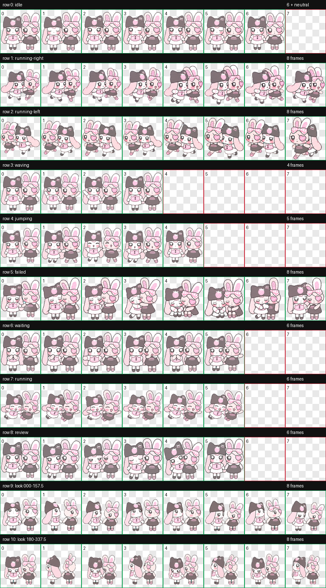

<div align="center">

# 🍓 Bibi & Fufu Codex Pet 🐰

**让 Bibi 和 Fufu 陪你一起写代码、等待任务、检查结果！**

一只软乎乎的双人 Codex v2 动态宠物，保留了两位角色的粉色手绘风格与牵手互动。



</div>

## ✨ 动画内容

包含 Codex Pet 所需的完整动画：

- 🌸 待机、眨眼与轻轻呼吸
- 🏃 向左、向右移动
- 👋 挥手打招呼
- 🎀 跳跃与悬浮
- 🥺 失败或取消反应
- ⏳ 等待用户输入
- 💨 任务运行中——牵手向前飞
- 🔍 检查完成结果
- 👀 16 个视线方向

## 📦 安装方法

### 方法一：手动安装（推荐）

1. 点击仓库右上角的 **Code → Download ZIP**。
2. 解压下载的 ZIP 文件。
3. 打开以下目录；如果 `pets` 文件夹不存在，可以手动创建：

   ```text
   %USERPROFILE%\.codex\pets
   ```

4. 在 `pets` 里面新建文件夹 `bibi-and-fufu`。
5. 将仓库里的这两个文件复制进去：

   - `pet.json`
   - `spritesheet.webp`

6. 安装完成后，目录结构应当是：

   ```text
   %USERPROFILE%\.codex\pets\bibi-and-fufu\
   ├── pet.json
   └── spritesheet.webp
   ```

   > 注意：不要再多套一层 `Bibi-Fufu-pet-main` 文件夹，否则 Codex 可能找不到 `pet.json`。

7. 完全退出并重新打开 Codex，然后在宠物选择器中启用 **Bibi and Fufu**。

### 方法二：PowerShell 安装

在解压后的仓库目录中打开 PowerShell，运行：

```powershell
$petDir = Join-Path $env:USERPROFILE '.codex\pets\bibi-and-fufu'
New-Item -ItemType Directory -Path $petDir -Force | Out-Null
Copy-Item -LiteralPath '.\pet.json', '.\spritesheet.webp' -Destination $petDir -Force
```

完成后重新打开 Codex，即可选择 **Bibi and Fufu**。

## 🩹 没有看到宠物？

请依次检查：

1. `pet.json` 和 `spritesheet.webp` 是否直接位于 `bibi-and-fufu` 文件夹内。
2. 文件是否被系统改名，例如 `pet.json.txt`。
3. `pet.json` 中是否包含 `"spriteVersionNumber": 2`。
4. 是否已经完全退出并重新打开 Codex。

## 🗂️ 仓库文件

| 文件 | 用途 |
| --- | --- |
| `pet.json` | Codex v2 宠物配置 |
| `spritesheet.webp` | 1536 × 2288、8 × 11 的透明动画图集 |
| `preview.png` | 全部动画状态预览 |

## 💗 原作者主页

喜欢 Bibi 和 Fufu 的话，请前往原作者主页支持：

- [哔哩哔哩 · 原作者主页](https://space.bilibili.com/3546967342844209?spm_id_from=333.337.0.0)
- [小红书 · 原作者主页](https://www.xiaohongshu.com/user/profile/688a00c200000000290173a0?m_source=pwa&xsec_token=ABJds6QJHmTjDTzH3vRoN8ICNgWbvNGconM8wQ7KnKa-U=&xsec_source=pc_search)

## 🌷 说明

这是基于原角色形象制作的非官方 Codex Pet。角色形象及相关权利归原作者所有；本仓库不代表原作者官方发布或授权。

希望这对可爱的小伙伴能让你的编码时间更开心一点。🍓🐰
